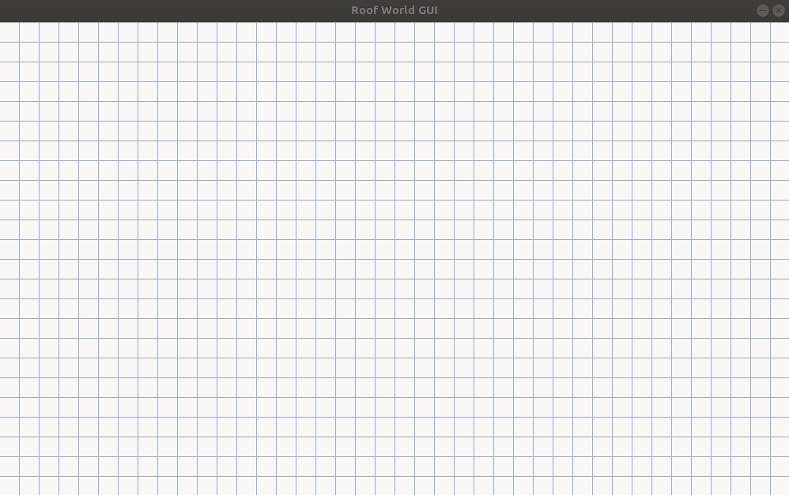
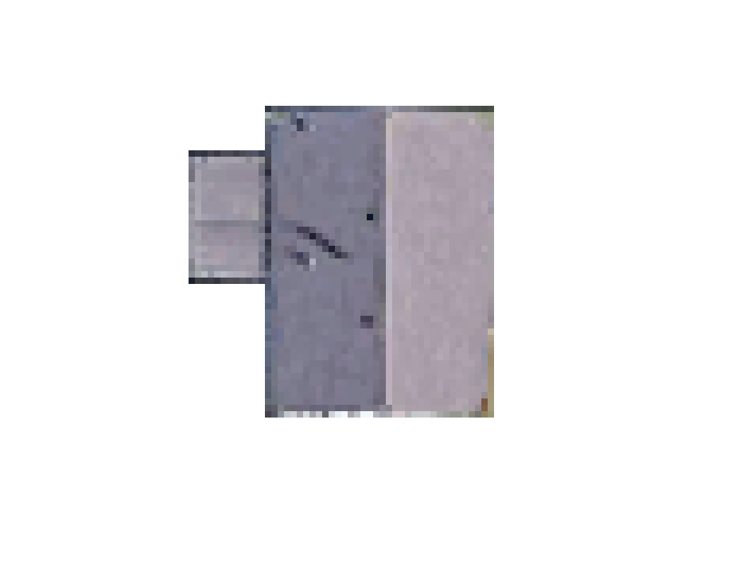

# Roof World (+ GUI)

*Inferring 3D structure from 2D graphs.*



## Quickstart

```bash
# python >= 3.10
pip install -r requirements.txt
```

## Run the GUI and interact with the model

```bash
python gui.py
```

**Basic GUI Usage**:

- **Left click** to add a point
- **Right click** on a point to start drawing a line, **Right click** on another point to connect them
- Press **p** on your keyboard to run prediction and produce a 3D plot showing the probability of each point being a "*high point*"

**Other useful features**:

- **Left click on a point** to toggle black/orange color (orange represents a *high point*, black represents "*all other points*") for creating training data
- **CTRL-z**: Undo
- **ESCAPE**: Quit "line drawing" mode
- **c**: (C)lear all points and lines
- **s**: (S)ave the current state to the `saved/` directory
- **b**: (B)ackground toggle (turn the graph paper on or off, useful for taking screenshots)
- **d**: (D)ump internal state to the console, showing the predicate logic representation

## Estimate cross-validation performance

The `saved/` directory contains 20 building layouts. Running `estimate_performance.py` estimates 5-fold cross-validation
for predicting whether a point is a *high point*.

```bash
python estimate_performance.py
```

## Other useful features

### Finding points and lines in an image with Hough transform



```bash
python find_lines.py docs/one_roof.png
```
